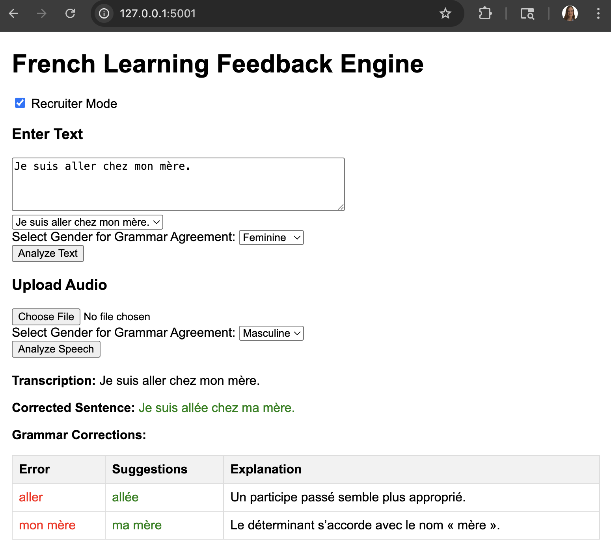
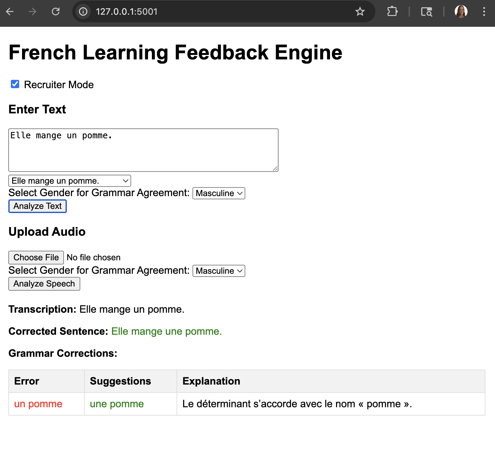
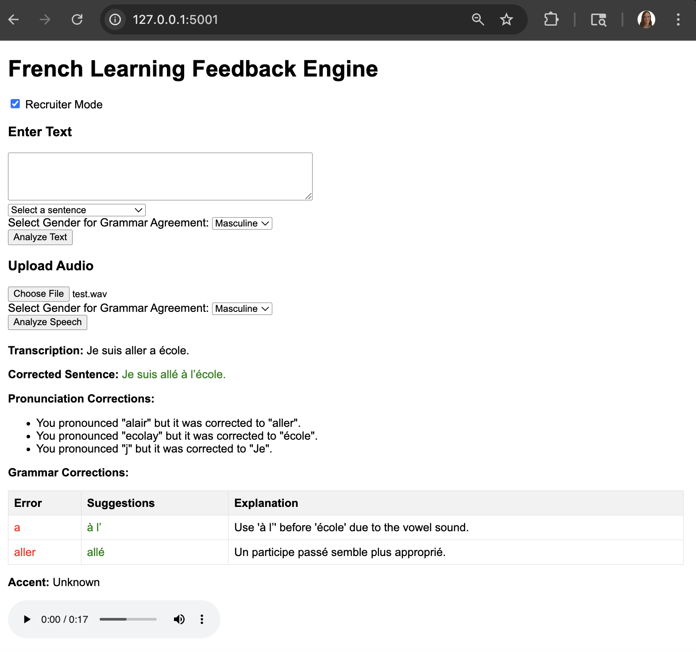
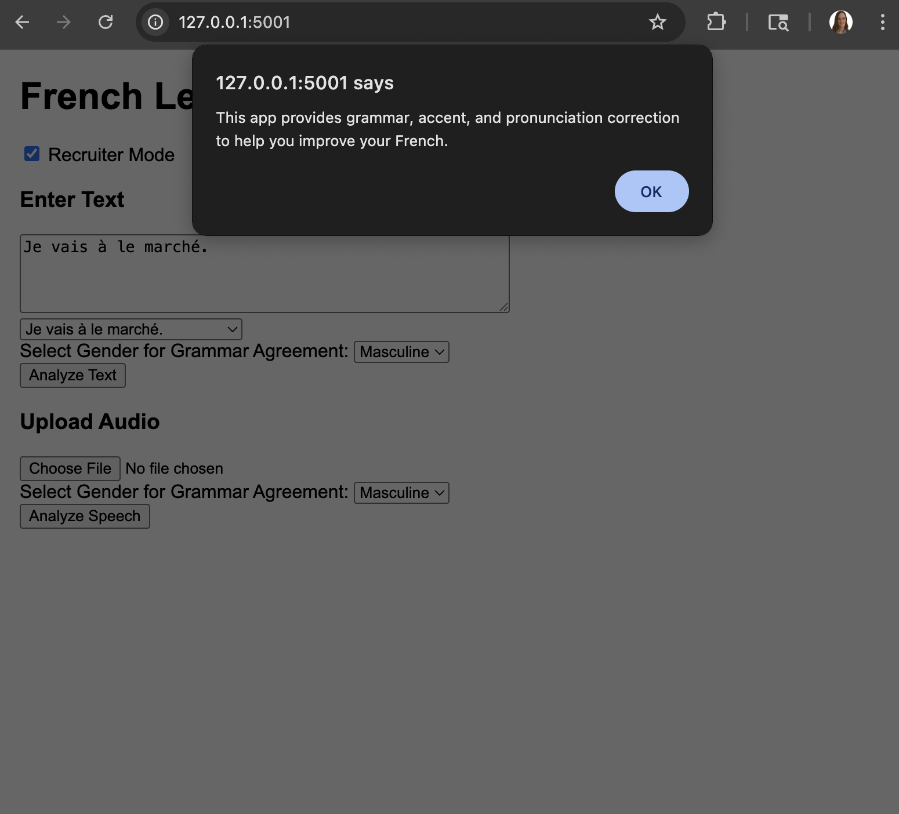

## French Learning Web App
This Flask-based web application is designed to help French learners improve their pronunciation, grammar, and accent usage. It transcribes spoken French, identifies errors, and provides personalized audio feedback using AI-powered tools like Whisper and gTTS.

### Features
- Real-time speech transcription with Whisper
- Detection of pronunciation and grammar errors (e.g., "a" to "à l'" before "école")
- Accent classification and analysis for pronunciation improvement
- Custom audio feedback in French, generated with gTTS
- Web interface for easy interaction
- Audio support for transcribing WAV files
- Explainability via an error table in the UI, showing errors, suggested corrections, and explanations
- Gender-aware grammar corrections (e.g., past participle agreement)
- Recruiter mode to demonstrate AI-driven grammar, accent, and pronunciation correction for evaluation purposes

### Screenshots
#### Main Interface
The main interface of a French language learning application designed to provide grammar, accent, and pronunciation feedback. 
The clean, web-based interface features two primary input methods: a text entry section with a large text area for typing French sentences, and an audio upload option. 
Users can enter French text directly or upload audio files for speech-to-text transcription. 
The interface includes gender selection for accurate grammar agreement corrections and a recruiter mode for demonstration purposes.

#### French Text Analysis with Grammar Correction - Article Agreement Error
The application has processed the French text "Je vais à le marché" and identified the grammatical error "à le" which should be contracted to "au".
The results display includes the original transcription, corrected sentence, and an explanatory error table with detailed grammar rules.
provides real-time grammar feedback and corrections.
The interface shows a text analysis tool where users can input French sentences (showing "Je suis aller chez mon mère" as an example) and receive detailed grammatical corrections.
The system identifies errors such as incorrect past participle agreement ("aller" should be "allée") and determiner agreement ("mon mère" should be "ma mère"), providing explanations in French for each correction.
The application includes both text input and audio upload functionality, with gender selection options for proper grammar agreement analysis.
It features a "Recruiter Mode" and displays corrections in a clear table format showing the original error, suggested correction, and grammatical explanation.
A French language learning application displaying grammar correction for the sentence "Elle mange un pomme." 
The system identifies an article agreement error, showing that "un pomme" (masculine article with feminine noun) should be corrected to "une pomme" (feminine article with feminine noun).
The interface includes text input functionality, gender selection for grammar agreement analysis, and audio upload capabilities. 
The correction is displayed in a clear table format showing the error, suggested correction, and explanation that "Le déterminant s'accorde avec le nom « pomme »" (The determiner agrees with the noun "pomme"). 
The application is running in "Recruiter Mode" and demonstrates how the system catches common French grammar mistakes related to noun-article gender agreement.

#### French Audio Analysis with Pronunciation and Grammar Corrections
A French language learning application showing comprehensive feedback from audio analysis of the sentence "Je suis aller à école." 
The system provides both pronunciation and grammar corrections after analyzing an uploaded audio file (test.wav). 
The pronunciation corrections show that the user mispronounced "aller" as "alair," "école" as "ecolay," and "J" incorrectly. 
The grammar corrections identify two errors: missing liaison ("a" should be "à l'" before "école" due to vowel sound) and incorrect past participle agreement ("aller" should be "allé"). 
The interface includes both text input and audio upload functionality with gender selection for proper grammar analysis. 
An audio player at the bottom allows playback of the original recording, and the system notes the accent as "Unknown." 
Feedback combining speech recognition, pronunciation analysis, and grammatical error detection.
The transcription shows the original spoken sentence, followed by the corrected version highlighting the grammatical fix. 
The interface includes both text and audio input capabilities with gender selection for grammar agreement analysis.

#### Recruiter Demonstration Mode
Special evaluation mode popup that introduces the application's AI-driven capabilities to potential employers or evaluators. 
This mode provides an overview of the grammar, accent, and pronunciation correction features before showcasing the full functionality.

### Files
- `src/analyze.py`: Processes audio or text input using Whisper for transcription and language_tool_python for grammar checks, generating personalized audio feedback with gTTS.
- `app/main.py`: Manages the Flask application, handling routes for the homepage and analysis requests while serving static files like audio feedback.
- `app/templates/index.html`: Provides the user interface with input fields for text or audio, buttons to trigger analysis, and a section to display feedback results.
- `tests/test_language_tool.py`: Contains unit tests for grammar-checking functionality (using language_tool_python).
- `requirements.txt`: Lists all Python dependencies required to run the web app.
- `test.wav`: A sample audio file containing example input.

### Requirements
- Python 3.10 (required for compatibility with specific library versions, e.g., Whisper, as some libraries may have issues with the system default Python 3.13). Check your version with: `python3 --version`.
- An internet connection (required for gTTS to generate audio).
- flask==3.0.3 
- language-tool-python==2.9.3
- torch>=2.4.0
- transformers==4.44.2
- gTTS==2.5.3
- openai-whisper==20240930
- shap==0.46.0
- librosa==0.10.2
- scikit-learn==1.5.1
- numpy==1.26.4     
- plotly==5.24.0  
  
### Setup and Usage
#### Option 1: From GitHub (First Time Setup)
- **Note**
  - Start in your preferred directory (e.g., cd ~/Desktop/ or cd ~/Documents/). 
1. Clone the repository: `git clone https://github.com/mariahcoleno/french-language-learning-platform.git`
2. Navigate to the project directory: `cd french_learning_web_app/`
3. Create a virtual environment: `python3.10 -m venv venv`
4. Activate the virtual environment: `source venv/bin/activate` # On Windows: venv\Scripts\activate
5. (Optional) Upgrade tools: pip install `--upgrade pip setuptools wheel` 
6. Install dependencies: `pip install -r requirements.txt`
   - If requirements.txt is missing, install manually: 
     `pip install flask==3.0.3 language-tool-python==2.9.3 torch>=2.4.0 transformers==4.44.2
      gTTS==2.5.3 openai-whisper==20240930 shap==0.46.0 librosa==0.10.2 scikit-learn==1.5.1 numpy==1.26.4 plotly==5.24.0`.
7. Proceed to "Run the App" below.

#### Option 2: Local Setup (Existing Repository)
1. Navigate to your local repository (adjust path as needed): `cd ~/Documents/french-language-learning-platform/french_learning_web_app`
2. Setup and activate a virtual environment:
   - If existing: `source venv/bin/activate` (adjust path if venv is elsewhere)
   - If new:
     - `python3.10 -m venv venv`
     - `source venv/bin/activate` # On Windows: venv\Scripts\activate
3. (Optional) Upgrade tools: pip install `--upgrade pip setuptools wheel` 
4. Install dependencies (if not already): `pip install -r requirements.txt` 
   - If requirements.txt is missing, use the manual install command above.
5. Proceed to "Run the App" below.

#### Run the App (Both Options):
1. `python3 -m app.main` 
   - Open your browser and navigate to http://127.0.0.1:5001.
   - Stop the app with Ctrl+C when done.
2. Use the interface:
   - Enter text (or select from the dropdown) and click "Analyze Text".
   - Upload a .wav file (click "Choose File", select the file, click "Open", then "Analyze Speech").
   - View the transcription, pronunciation corrections, and an error table with errors, suggestions, and explanations.
   - Listen to the audio feedback from a French speaker addressing corrected pronunciation and grammar.  

### Sample Data
- Je vais à le marché.
- Je suis aller chez mon mère.
- Elle mange un pomme. 
- `test.wav`: "Je suis aller a école."
- `test2.wav`: "Nous sommes fatigues après la école."

### Project Structure
- french-language-learning-platform/
  - french_learning_web_app/
    - app/
      - static/
        - audio/ (multiple correction files)
      - templates
        - index.html
      - uploads/
        - input.wav
      - main.py
    - screenshots (multiple sample images)
    - src/
      - __init__.py
      - analyze.py 
    - tests/
      - test_language_tool.py 
    - README.md
    - requirements.txt
    - test.wav
    - test2.wav
  - .gitignore

### Additional Notes
- The app runs on port 5001 to avoid common port conflicts and ensure faster startup. Access it at http://127.0.0.1:5001 after starting the server. If you encounter issues, check for port conflicts with lsof -i :5001 or run on a different port by modifying app/main.py (e.g., change port=5001 to port=5002 and access http://127.0.0.1:5002).
- The `app/uploads/` directory is created automatically to store temporary uploaded files and does not need to be versioned.

### License
- All rights reserved. Contact colenomariah92@gmail.com for licensing inquiries.

### Development Notes
- Application developed through iterative prompt engineering with AI tools (Claude/Grok) for rapid prototyping and learning.
